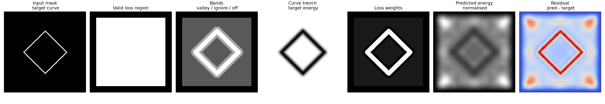
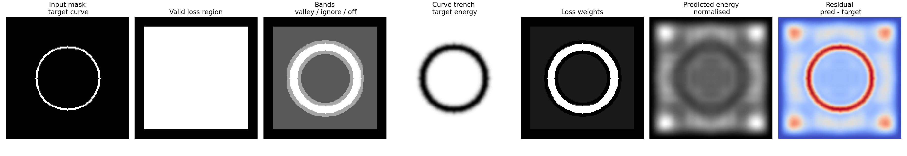
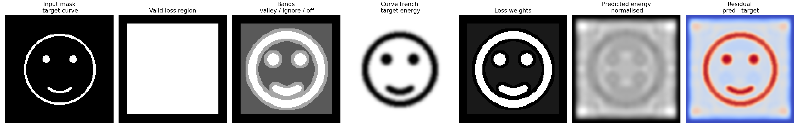
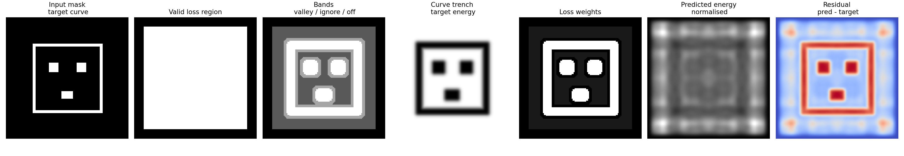
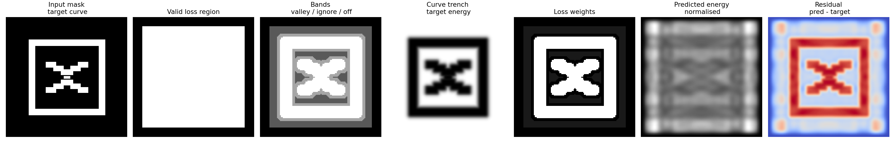

# Inverse Chladni Energy Landscape Design

An important and underdiscussed aspect in life is: **is it better to do a dumb smart thing or a smart dumb thing?** I will leave it up to the reader to consider which target this project is aiming for.

The genesis of this idea was watching a YouTube video on Chladni figures and my reptilian engineer's brain hissing: "it's all eigenvalues and mode shapes, why do they never talk about mode shapes?" It got bolder: "It's all linear, so I bet if you did a superposition of tones, you could probably make some really cool shapes. Maybe even design them!"

In the cold light of carefully following it through, it emerged that care is required because a superposition of different frequencies does **not** give stationary nodal lines. The plate does not patiently hold one lovely Fourier doodle while the sand arranges itself for our amusement. However, the idea can be turned into an **energy landscape design problem**: choose a set of modes so that some parts of the plate have lower time-averaged vibration energy, making them more plausible places for sand to settle.

Along this journey we get to ask the question Kac never asked:

> Can one see a face in a plate via tactical squeaking?

Spoiler: sort of, kinda, but not really.

## What this repo does

This is an experimental inverse-design script for Chladni-ish energy fields on an idealised square plate. Given a binary target mask, it tries to find nonnegative modal weights such that a time-averaged energy field has low-energy valleys near the target strokes and higher energy away from them.

The main script is:

```bash
chladni_inverse_design_stochastic.py
```

It is not a physically faithful simulator of a real plate, actuator, sand, damping, support conditions, grain transport, bad speakers, or the spitefulness of reality. It is a small numerical playground for asking:

> If the only basis functions I have are squared plate modes, what kinds of low-energy drawings can I make?

## Quick start

The script uses `uv` inline script dependencies, so from the repo directory you can run something like:

```bash
uv run chladni_inverse_design_stochastic.py blocky_smiley.png \
  --w-max 220 \
  --size 128 \
  --boundary-margin 10 \
  --loss soft-basin \
  --curve-target-sigma 3 \
  --valley-radius 3 \
  --offcurve-radius 7 \
  --steps 5000 \
  --lr 0.02 \
  --temperature 0.06 \
  --ranking-weight 1.0 \
  --ranking-margin 0.15 \
  --ranking-pairs 2048 \
  --bce-batch-size 2048 \
  --hard-negative-fraction 0.25 \
  --hard-negative-refresh 50 \
  --init-noise 0.05 \
  --preview chlandi_preview_blocky_smiley.png
```

The command writes:

- a preview image, showing the input mask, bands, target, predicted energy, and residual;
- an energy image;
- an `.npz` bundle containing coefficients, modes, masks, and diagnostics.

## Tiny plate theory, with appropriate levels of hand-waving

The clean classroom version of a square simply-supported plate uses the Kirchhoff-Love thin plate equation

$$
D \nabla^4 w + \rho h \frac{\partial^2 w}{\partial t^2} = 0,
$$

where $w(x,y,t)$ is the transverse displacement, $D$ is the flexural rigidity, $\rho$ is density, and $h$ is thickness.

For a simply-supported square plate, the edge can rotate but cannot move vertically. In boundary-condition speak, the edge has

$$
w = 0, \qquad M_n = 0,
$$

where $M_n$ is the bending moment normal to the edge. This gives the pleasingly convenient mode shapes

$$
\phi_{mn}(x,y) = \sin(m \pi x)\sin(n \pi y),
$$

using unit-square coordinates $x,y \in [0,1]$.

The corresponding frequency ordering is proportional to

$$
\omega_{mn} \propto m^2 + n^2.
$$

The code uses this nondimensional quantity as `omega_nd = m*m + n*n`, and `--w-max` selects all modes up to that value.

### Why not just add modes and draw anything?

The original dream was something like:

$$
f(x,y) = \sum_k a_k \phi_k(x,y),
$$

then pick $a_k$ so the nodal set $f(x,y)=0$ draws a cat, a smiley, or the word "help".

The problem is that if the modes are driven at different frequencies, the displacement is really

$$
w(x,y,t) = \sum_k a_k \phi_k(x,y)\cos(\omega_k t + \theta_k),
$$

which is not a static drawing unless the frequencies are the same or otherwise locked in a special way. Sand is also unlikely to care about the signed displacement. It is more plausibly responding to something related to time-averaged vibration intensity.

So this repo uses the more boring but more defensible model

$$
E(x,y) = \sum_k b_k \phi_k(x,y)^2,
\qquad b_k \ge 0.
$$

This is the crucial representational bias. It is a **nonnegative mixture of squared mode shapes**. That means no signed cancellation. It likes boxes, bands, grids, crosses, and big connected glyphs. It does not naturally enjoy tiny separated eyes, subtle smiles, or other aesthetic demands.

The plate is not wrong. We are just asking it to do graphic design with a xylophone.

## From least squares to ML-flavoured pleading and bargining

The first obvious objective was plain regression: make the predicted energy match a target energy image.

$$
\min_{b_k \ge 0} \left\|\sum_k b_k \phi_k^2 - E_{\text{target}}\right\|_2^2.
$$

This works a bit, but it optimises the wrong thing. We do not really care whether the bright peaks match. We care whether the target strokes become low-energy valleys, and whether off-stroke regions are relatively higher.

So the script evolved into a small pile of ML-ish hacks.

### 1. Curve targets, not filled masks

A ring should be a ring-shaped trench, not a filled circular bowl. The mask is treated as a curve/stroke. We compute distance to the target stroke and build a trench-shaped target energy:

$$
E_{\text{target}}(x,y) = 1 - \exp\left(-\frac{d(x,y)^2}{\sigma^2}\right),
$$

where $d(x,y)$ is the distance to the target mask. Low on the stroke, high away from it.

### 2. Ignore the boundary strip

The simply-supported basis forces every mode to vanish at the boundary, so the energy model also vanishes there:

$$
E(x,y)=0 \quad \text{on the boundary}.
$$

That makes the boundary an unavoidable low-energy region in this toy model. The script therefore ignores a configurable boundary margin with `--boundary-margin`.

### 3. Valley / ambiguous / off-curve bands

Pixels near the target stroke are labelled as valley pixels. Pixels far enough away are off-curve pixels. Pixels in between are ignored. This avoids screaming at the optimiser about a fuzzy transition zone.

Relevant knobs:

```bash
--valley-radius 3
--offcurve-radius 7
```

### 4. Soft basin classification

Instead of directly matching energy values, the PyTorch loss turns energy into a probability of being in the low-energy basin:

$$
p(x,y) = \sigma\left(\frac{\tau - E(x,y)}{T}\right),
$$

where $\tau$ is a learned threshold and $T$ is `--temperature`.

Then it uses binary cross entropy over sampled valley/off-curve pixels.

### 5. Ranking loss

The more honest objective is comparative:

$$
E(\text{valley}) + \delta < E(\text{off-curve}).
$$

The script samples valley/off-curve pairs and applies a margin ranking loss:

$$
\max\left(0, E_v - E_o + \delta\right).
$$

Relevant knobs:

```bash
--ranking-weight 1.0
--ranking-margin 0.15
--ranking-pairs 2048
```

### 6. Component-balanced sampling

A smiley face has a huge outer outline and tiny eyes. If you sample valley pixels uniformly, the eyes are basically a rounding error. The script samples connected components more evenly so small features get a vote.

This was one of the more useful hacks. It is enabled by default and can be disabled with:

```bash
--no-component-balanced
```

### 7. Hard negatives

Some off-curve pixels end up accidentally low-energy. These are the false valleys. The script can sample a fraction of off-curve negatives from the currently lowest-energy off-curve pixels.

```bash
--hard-negative-fraction 0.25
--hard-negative-refresh 50
```

Refreshing every step is slower, so the hard-negative pool is cached and refreshed every N optimisation steps.

### 8. Stochastic batches and noisy init

Full-batch optimisation plus symmetric initialisation tends to sit politely inside the symmetry of the square basis. Stochastic BCE batches and small random coefficient initialisation help jiggle it out of overly tidy solutions while we pray for symmetry breaking.

```bash
--bce-batch-size 2048
--init-noise 0.05
```

This is not magic, it might not even do very much.

## Results

The results below are not claims of physical reality. They are evidence from a toy model with a strong representational bias and an increasingly desperate optimiser.

### Square: win

The square is the plate's native language. It is blocky, symmetric, and aligned with the basis. The model approves.



### Circle: partial win

The circle sort of works, but the model would much rather make broad basins and square-ish structure. A ring is already asking a nonnegative squared basis to do something slightly fancy.



### Smooth smiley: fail, but an educational fail

A normal smiley has small separated features and curved strokes. The model produces a haunted ghost of a face, which is funny but not especially obedient.



### Blocky smiley: less fail

A blocky, rectilinear smiley works better. This was the key lesson: do not merely optimise the coefficients, **optimise the target for the representation**. Lean into the model's bias instead of pretending it is a tiny artist.



### Cross: win, reluctantly

After several attempts to make a face that the model could represent, the honest answer was: it wants to draw a cross in a box. Fine. Cross in a box it is.



## What I think this shows

The fun lesson is not that this model can draw arbitrary Chladni figures. It cannot.

The fun lesson is that the whole thing becomes a tiny representation-learning problem:

- The squared modal basis has a strong inductive bias.
- The naive loss is wrong.
- Better sampling matters.
- Hard negatives matter.
- Target design matters.
- The final result improves most when you stop fighting the model and give it a target it can plausibly express.

In other words, this project accidentally became a tiny parable about machine learning, except the neural network is a plate and the activation functions are squeaky sine-squared rectangles.

## Known limitations

- The plate model is idealised and simply-supported. A real Chladni plate is often closer to a free or point-supported plate, with actuator coupling, damping, etc, etc.
- Sand transport is not simulated. The script designs a scalar energy field, not particle motion.
- Multi-frequency time averaging destroys signed cancellation, so the representation is much weaker than arbitrary Fourier synthesis.
- The boundary behaviour is weird because the toy basis forces zero energy at the boundary.
- The optimisation is hacky by design. This is a weekend distraction from real work, not a design standard.

## Interesting next steps

1. **Empirical mode library**  
   Sweep a real plate, photograph its response fields, and optimise over measured intensities instead of analytic sine-squared modes.

2. **Transport-in-the-loop**  
   Use a camera to estimate how sand actually moves under each tone, then choose tones greedily or with MPC.

3. **Coherent fantasy model**  
   Compare the time-averaged model to a signed coherent model, e.g. $E=(\sum_k a_k\phi_k)^2$, to measure how much expressivity is lost by incoherent multi-frequency driving.

4. **Frequency-weighted regularisation**  
   Penalise ugly high-frequency solutions with something like $\sum_k b_k \omega_k^p$.

5. **Better target generation**  
   Search over target masks as well as coefficients. This is the cursed but probably correct version: optimise the design for the representational bias of the plate.

## File guide

- `chladni_inverse_design_stochastic.py` — main script.
- `square.png`, `circle.png`, `smiley.png`, `blocky_smiley.png`, `cross.png` — input masks.
- `chlandi_preview_*.png` / `chladni_preview_cross.png` — saved preview images.

## Name spelling apology

Some generated preview files are named `chlandi_*` rather than `chladni_*`. This is not a deep mathematical statement. It is just fat fingers.

## Acknowledgement

Initial prototyping and implementation iterations were developed collaboratively with ChatGPT (OpenAI), then adapted and organized into this repository by Paul Bellette. Let's face it, when I was a postdoc this kind of distraction would have taken me weeks or months of screwing around, with AI that has compressed to hours. If that isn't progress, I don't know what is.
